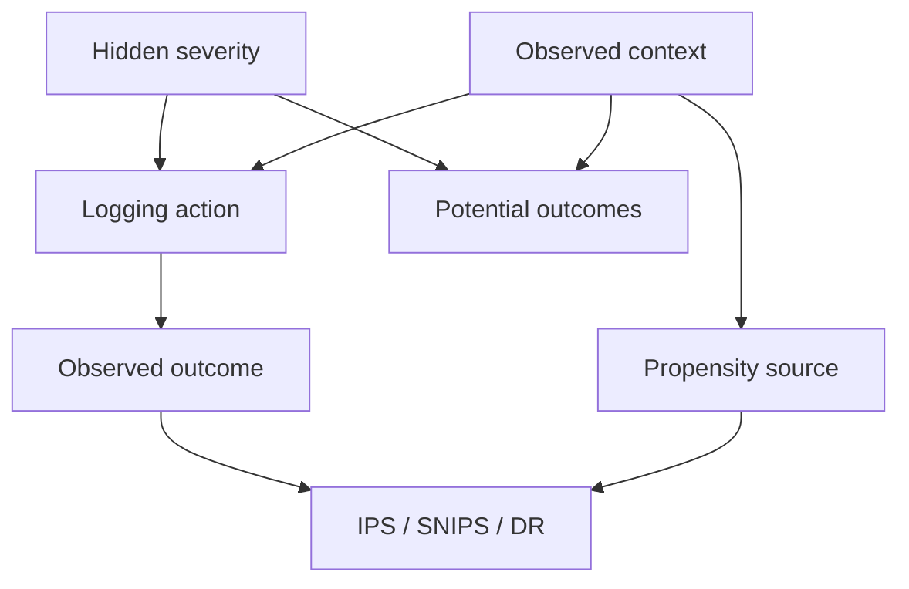

# v3.7 Propensity-Robust OPE Architecture

## Evaluation boundary

The logging process observes risk, uncertainty, time, and task class. A latent autocorrelated severity affects potential failure outcomes; when hidden-confounding strength is nonzero, it also affects the logging action. The evaluator never receives that severity.

Paired protected and unprotected outcomes plus the true behavior propensity are retained only behind the simulation-evaluation boundary. They score estimators and diagnostics; they never choose actions or fit the observed nuisance models.

## Propensity sources

| Mode | Uses current observed drift | Uses hidden severity | Reuses evaluation sample |
|---|---:|---:|---:|
| `recorded_true` | Yes | Yes | No fitting; diagnostic only |
| `recorded_nominal` | Yes | No | No fitting |
| `stale_recorded` | No | No | No fitting |
| `estimated_full` | Yes, if learned | No | Yes |
| `estimated_crossfit` | Yes, if learned | No | Fold-separated predictions |
| `misspecified` | Partially | No | Yes |

Critical tasks are always protected by the logger. Estimated propensities are clipped numerically and reset to one for this safety class.

## Estimation and stress envelope

The point evaluators reuse v3.6's IPS, SNIPS, DR, and clipped-DR structures. The new sensitivity diagnostic perturbs the evaluator's row-wise propensity odds by a user-selected factor gamma, then recomputes lower and upper empirical DR-style corrections. Residual signs determine which propensity endpoint is pessimistic.

This construction is useful for stress testing but intentionally weaker than a sharp marginal-sensitivity analysis. It does not optimize jointly over all compatible latent distributions and does not attach a causal confidence level.

Two distinct quantities are therefore reported:

- **aggregate interval coverage**: whether this finite-run envelope covers the paired oracle or true-propensity estimate;
- **required row-wise gamma**: the largest hidden synthetic true-versus-used propensity odds gap.

The first can be positive while the second is much larger than the selected gamma. They must not be conflated.

## Selection rule

The point selector minimizes estimated miss plus protection cost. The sensitivity guard permits a non-baseline candidate only when its sensitivity upper objective is below the baseline's sensitivity lower objective. Otherwise it returns baseline. This is a deliberately strict heuristic used to expose fallback, not a safe-policy-improvement certificate.
